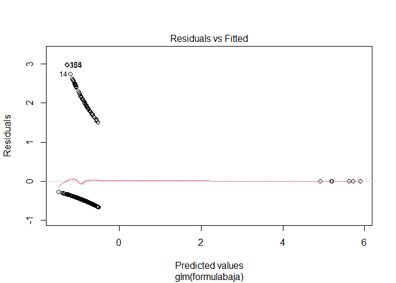
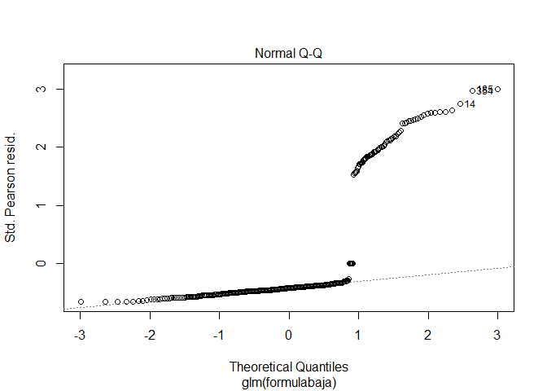
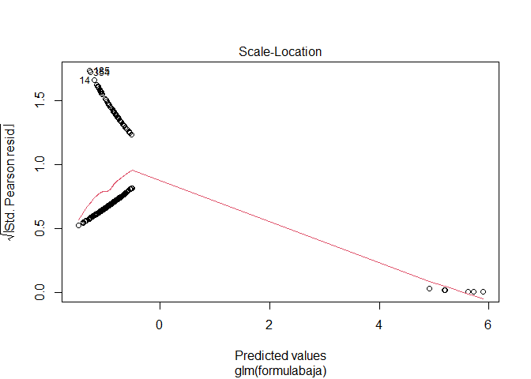
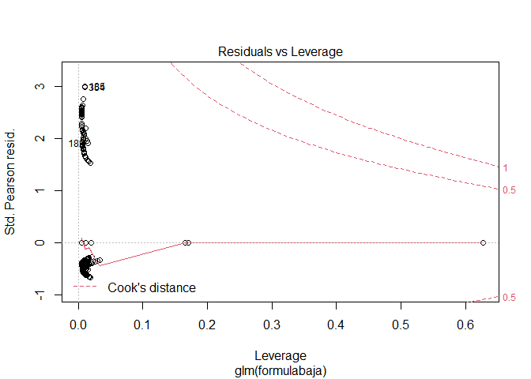

Análisis del caso Corusan
================

# Importar datos

``` r
options(scipen = 999)
library(readxl)
library(tidyverse)
```

    ## Warning: package 'tidyr' was built under R version 4.0.4

    ## Warning: package 'dplyr' was built under R version 4.0.5

``` r
julio19 <- readxl::read_excel("Prueba consultores ABRIL 2021 (1).xlsx", sheet=3)
bajas <- readxl::read_excel("Prueba consultores ABRIL 2021 (1).xlsx", sheet=4)
altas <- readxl::read_excel("Prueba consultores ABRIL 2021 (1).xlsx", sheet=5)
```

# Caso a resolver

## 1.1 ¿Cuántos FTEs tiene la compañía en julio?

``` r
fte <- function(x,y){
  (sum(x)/44)+(sum(y)/37.5)
  
}

horas44 <- julio19 %>% 
  filter(`HORAS TEÓRICAS SEMANALES POR UNIDAD DE NEGOCIO`==44.0) %>%
  select(`PROMEDIO DE HORAS  SEMANALES TRABAJADAS EN EL MES`) %>% 
  as.data.frame()


horas37 <- julio19 %>% 
  filter(`HORAS TEÓRICAS SEMANALES POR UNIDAD DE NEGOCIO`==37.5) %>% 
  select(`PROMEDIO DE HORAS  SEMANALES TRABAJADAS EN EL MES`) %>% 
  as.data.frame()

FTES <- fte(horas44,horas37)
```

La compañía tiene 45636.062303 FTEs en julio

## 1.2 ¿Qué porcentaje de dedicación tienen los empleados de lacompañía durante el mes de Julio de 2019?

``` r
dedicacion <- FTES/nrow(julio19)*100
```

La compañía tiene un porcentaje de 94.2290316 de dedicación

## 2 ¿Cuantos empleados tiene la compañía a 31 de Agosto teniendo en cuenta las altas y las bajas de ese período?

``` r
emplagosto <- nrow(julio19)-nrow(bajas)-nrow(altas)
```

La compañia tiene a 31 de agosto 47488 empleados

## 3 ¿Qué Índices de rotación ha tenido la compañía durante el mes de Agosto?

### 3\. A. Índice de Rotación Bruta: Número de bajas totales/num empleados inicio del período \* 100

``` r
irb <- nrow(bajas)/nrow(julio19)*100
```

El índice de rotación bruta es de 0.7433256%

### 3\. B. Índice de Rotación Neta: \[(Número de bajas + número de contrataciones) / 2\] /num empleados inicio periodo \* 100

``` r
irn <- ((nrow(bajas)+nrow(altas)/2)/nrow(julio19))*100
```

El índice de rotación neta es de 1.3452128%

### 3\. C. Índice de Rotación Bruta voluntaria: Número de bajas voluntarias / num empleados inicio del perído \* 100

``` r
volunt <- c("b.2) Otras bajas vegetativas","b.1) Renuncias voluntarias")
irbv <- nrow(bajas[bajas$`Tipo de baja global`%in% volunt,])/nrow(julio19)*100
```

El índice de rotación bruta voluntaria es 0.1445355%

### 3\. D. Índice de Rotación Bruta Involuntaria: Número de bajas involuntarias / num empleados inicio del perído \* 100

``` r
irbi <- nrow((bajas[bajas$`Tipo de baja global` 
  =="a.2 ) X otras causas (Indemnizaciones)",]))/nrow(julio19)*100
```

El índice de rotación bruta involuntaria es 0.59879%

## 4\. Calcula la antigüedad media de los empleados que trabajan en Andalucía

``` r
julio19$antiguedad <-(as.POSIXct("2019-07-31")-julio19$`Fecha de Alta`) %>% as.double()

andalucia <- c("ALMERIA","CADIZ","CORDOBA","GRANADA","HUELVA","JAEN","MALAGA","SEVILLA")

antandalucia <-julio19 %>% filter(julio19$`Localización Ciudad`%in% andalucia)
mediandalucia <- mean(antandalucia$antiguedad)/365.25
```

La antigüedad media de los empleados que trabajan en Andalucía es
27.0201656 años

# Análisis libre

## 1\. ¿Está cumpliendo CORUSAN con la LISMI?

``` r
julio19$Discapacidad <- julio19$Discapacidad %>% as.factor()
discpais <- julio19 %>% group_by(`Localización País`, Discapacidad) %>% summarise(percent = 100*n()/nrow(julio19), .groups = "drop")

# discap <- ggplot(data = filter(discpais, Discapacidad=="Sí"))+
#   aes(x=`Localización País`, y=percent,color=`Localización País`)+geom_bar(stat = "identity", position = "fill")
# discap
```

## 2\. Modelo lineal

``` r
bajas$tipobaja <- 
ifelse(bajas$`Tipo de baja global`=="a.2 ) X otras causas (Indemnizaciones)",0,1)

bajas$edad <- bajas$`Fecha fin de contrato` - bajas$`Fecha nacimiento`

formulabaja <- formula(tipobaja~`Unidad de Negocio` + Genero + edad)

modelobaja <- glm(formula = formulabaja, family = binomial(link = "probit"), data = bajas)

summary(modelobaja)
```

    ## 
    ## Call:
    ## glm(formula = formulabaja, family = binomial(link = "probit"), 
    ##     data = bajas)
    ## 
    ## Deviance Residuals: 
    ##     Min       1Q   Median       3Q      Max  
    ## -0.8564  -0.6641  -0.5829  -0.4740   2.1428  
    ## 
    ## Coefficients:
    ##                               Estimate   Std. Error z value Pr(>|z|)  
    ## (Intercept)                -0.13327281   0.36798474  -0.362   0.7172  
    ## `Unidad de Negocio`España   6.60481264 146.57512651   0.045   0.9641  
    ## GeneroM                    -0.28487732   0.15753206  -1.808   0.0705 .
    ## edad                       -0.00005164   0.00002899  -1.781   0.0749 .
    ## ---
    ## Signif. codes:  0 '***' 0.001 '**' 0.01 '*' 0.05 '.' 0.1 ' ' 1
    ## 
    ## (Dispersion parameter for binomial family taken to be 1)
    ## 
    ##     Null deviance: 354.67  on 359  degrees of freedom
    ## Residual deviance: 328.27  on 356  degrees of freedom
    ## AIC: 336.27
    ## 
    ## Number of Fisher Scoring iterations: 14

``` r
plot(modelobaja)
```

<!-- --><!-- --><!-- --><!-- -->
